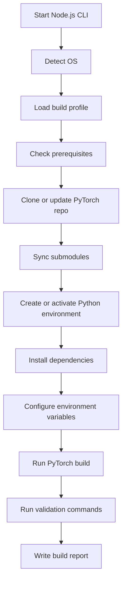

# Architecture: Cross-Platform PyTorch Source Build Automation in Node.js + TypeScript

## 1. Purpose

This document defines the architecture for automating PyTorch source builds on **Linux** and **Windows** using a **Node.js + TypeScript** implementation.

The goal is not to rewrite PyTorch's build system. PyTorch is still built by its official Python/CMake/Ninja/MSVC/GCC toolchain. The Node.js layer acts as an orchestration tool that:

- checks prerequisites,
- prepares environment variables,
- clones or updates the PyTorch repository,
- installs dependencies,
- executes platform-specific build commands,
- captures logs,
- validates the resulting installation.

Official PyTorch guidance recommends building from source when users need the latest code or need to develop PyTorch core, and notes that CUDA is required for CUDA-enabled GPU builds. On Windows, Visual Studio with the MSVC toolset and NVTX are also required.

## 2. What Is the Same Across Linux and Windows

| Area | Same Concept |
|---|---|
| Source repository | Clone `pytorch/pytorch` with submodules. |
| Python environment | Use a controlled Python/Conda environment. |
| Dependency install | Install Python requirements and build tools such as CMake and Ninja. |
| Build entrypoint | Build through Python setup tooling, for example `python setup.py develop` or equivalent project-supported commands. |
| Optional acceleration | CUDA/ROCm/CPU-only choices are controlled by installed toolchains and environment variables. |
| Build configuration | Environment variables control options such as CUDA usage, CMake prefix path, compiler behavior, and parallelism. |
| Validation | Import `torch`, print version, test CUDA availability when applicable. |
| Logging | Capture stdout/stderr and persist logs for debugging. |

## 3. What Is Different

| Area | Linux | Windows |
|---|---|---|
| Shell | Bash/sh | PowerShell or `cmd.exe` |
| Compiler | GCC/Clang | MSVC via Visual Studio Build Tools |
| Package manager | apt, yum, dnf, pacman, conda, pip | winget/choco/manual installers, conda, pip |
| CUDA paths | Usually `/usr/local/cuda` | Usually `C:\Program Files\NVIDIA GPU Computing Toolkit\CUDA\vXX.X` |
| Environment syntax | `export VAR=value` | `$env:VAR="value"` in PowerShell or `set VAR=value` in cmd |
| Build tools | `build-essential`, `gcc`, `g++`, `cmake`, `ninja` | Visual Studio Build Tools, MSVC, CMake, Ninja |
| Path separator | `:` | `;` |
| Executable suffix | no suffix | `.exe`, `.bat`, `.cmd` |
| GPU stack | CUDA or ROCm depending on GPU/vendor | CUDA is common; ROCm Windows support is more limited and should be treated separately |
| Common failure modes | Missing compiler headers, CUDA mismatch, low RAM, incompatible GCC | MSVC environment not loaded, long path issues, CUDA/NVTX path problems |

## 4. High-Level Build Flow



## 5. Recommended Project Structure

```text
pytorch-build-orchestrator/
  package.json
  tsconfig.json
  src/
    index.ts
    cli.ts
    core/
      command.ts
      logger.ts
      platform.ts
      paths.ts
    build/
      build-plan.ts
      linux-builder.ts
      windows-builder.ts
      validator.ts
    config/
      schema.ts
      defaults.ts
  configs/
    linux.cpu.json
    linux.cuda.json
    windows.cpu.json
    windows.cuda.json
  logs/
  README.md
```

## 6. Example Configuration

```json
{
  "repoUrl": "https://github.com/pytorch/pytorch.git",
  "workDir": "./workspace",
  "branch": "main",
  "python": "python",
  "useCuda": false,
  "cudaHome": null,
  "maxJobs": 8,
  "buildMode": "develop"
}
```

## 7. TypeScript Interfaces

```ts
export type PlatformName = "linux" | "windows";
export type BuildMode = "develop" | "wheel";

export interface BuildConfig {
  repoUrl: string;
  workDir: string;
  branch: string;
  python: string;
  useCuda: boolean;
  cudaHome?: string | null;
  maxJobs?: number;
  buildMode: BuildMode;
}

export interface CommandSpec {
  command: string;
  args: string[];
  cwd?: string;
  env?: NodeJS.ProcessEnv;
}

export interface BuildStep {
  name: string;
  run: CommandSpec;
}
```

## 8. Command Runner

```ts
import { spawn } from "node:child_process";

export function runCommand(spec: CommandSpec): Promise<void> {
  return new Promise((resolve, reject) => {
    const child = spawn(spec.command, spec.args, {
      cwd: spec.cwd,
      env: { ...process.env, ...spec.env },
      shell: process.platform === "win32",
      stdio: "inherit"
    });

    child.on("error", reject);
    child.on("close", code => {
      if (code === 0) resolve();
      else reject(new Error(`${spec.command} exited with code ${code}`));
    });
  });
}
```

## 9. Platform Detection

```ts
export function detectPlatform(): PlatformName {
  if (process.platform === "linux") return "linux";
  if (process.platform === "win32") return "windows";
  throw new Error(`Unsupported platform: ${process.platform}`);
}
```

## 10. Shared Build Steps

```ts
import path from "node:path";

export function createSharedSteps(config: BuildConfig): BuildStep[] {
  const repoDir = path.join(config.workDir, "pytorch");

  return [
    {
      name: "Clone PyTorch repository",
      run: {
        command: "git",
        args: [
          "clone",
          "--recursive",
          "--branch",
          config.branch,
          config.repoUrl,
          repoDir
        ]
      }
    },
    {
      name: "Update submodules",
      run: {
        command: "git",
        args: ["submodule", "sync", "--recursive"],
        cwd: repoDir
      }
    },
    {
      name: "Initialize submodules",
      run: {
        command: "git",
        args: ["submodule", "update", "--init", "--recursive"],
        cwd: repoDir
      }
    },
    {
      name: "Install Python requirements",
      run: {
        command: config.python,
        args: ["-m", "pip", "install", "-r", "requirements.txt"],
        cwd: repoDir
      }
    }
  ];
}
```

## 11. Linux Build Plan

```ts
import path from "node:path";

export function createLinuxBuildSteps(config: BuildConfig): BuildStep[] {
  const repoDir = path.join(config.workDir, "pytorch");

  const env: NodeJS.ProcessEnv = {
    MAX_JOBS: String(config.maxJobs ?? 4),
    USE_CUDA: config.useCuda ? "1" : "0"
  };

  if (config.cudaHome) {
    env.CUDA_HOME = config.cudaHome;
  }

  return [
    ...createSharedSteps(config),
    {
      name: "Install build helpers",
      run: {
        command: config.python,
        args: ["-m", "pip", "install", "cmake", "ninja"],
        cwd: repoDir
      }
    },
    {
      name: "Build PyTorch on Linux",
      run: {
        command: config.python,
        args:
          config.buildMode === "wheel"
            ? ["setup.py", "bdist_wheel"]
            : ["setup.py", "develop"],
        cwd: repoDir,
        env
      }
    }
  ];
}
```

## 12. Windows Build Plan

```ts
import path from "node:path";

export function createWindowsBuildSteps(config: BuildConfig): BuildStep[] {
  const repoDir = path.join(config.workDir, "pytorch");

  const env: NodeJS.ProcessEnv = {
    MAX_JOBS: String(config.maxJobs ?? 4),
    USE_CUDA: config.useCuda ? "1" : "0"
  };

  if (config.cudaHome) {
    env.CUDA_PATH = config.cudaHome;
    env.CUDA_HOME = config.cudaHome;
  }

  return [
    ...createSharedSteps(config),
    {
      name: "Install build helpers",
      run: {
        command: config.python,
        args: ["-m", "pip", "install", "cmake", "ninja"],
        cwd: repoDir
      }
    },
    {
      name: "Build PyTorch on Windows",
      run: {
        command: config.python,
        args:
          config.buildMode === "wheel"
            ? ["setup.py", "bdist_wheel"]
            : ["setup.py", "develop"],
        cwd: repoDir,
        env
      }
    }
  ];
}
```

> Important: On Windows, this should be executed from a shell where the Visual Studio/MSVC build environment is available, such as “Developer PowerShell for VS” or after running `vcvarsall.bat`.

## 13. Build Orchestrator

```ts
export async function runBuild(config: BuildConfig): Promise<void> {
  const platform = detectPlatform();

  const steps = platform === "linux"
    ? createLinuxBuildSteps(config)
    : createWindowsBuildSteps(config);

  for (const step of steps) {
    console.log(`\n==> ${step.name}`);
    await runCommand(step.run);
  }

  await validateBuild(config);
}
```

## 14. Validation Step

```ts
import path from "node:path";

export async function validateBuild(config: BuildConfig): Promise<void> {
  const repoDir = path.join(config.workDir, "pytorch");

  await runCommand({
    command: config.python,
    args: ["-c", "import torch; print(torch.__version__); print(torch.cuda.is_available())"],
    cwd: repoDir
  });
}
```

## 15. CLI Entrypoint

```ts
import fs from "node:fs";

async function main() {
  const configPath = process.argv[2];

  if (!configPath) {
    throw new Error("Usage: node dist/index.js <config.json>");
  }

  const config = JSON.parse(fs.readFileSync(configPath, "utf8")) as BuildConfig;
  await runBuild(config);
}

main().catch(error => {
  console.error(error);
  process.exit(1);
});
```

## 16. Example Commands

### Linux CPU Build

```bash
npm run build
node dist/index.js configs/linux.cpu.json
```

### Linux CUDA Build

```bash
npm run build
CUDA_HOME=/usr/local/cuda node dist/index.js configs/linux.cuda.json
```

### Windows CPU Build

```powershell
npm run build
node dist/index.js configs/windows.cpu.json
```

### Windows CUDA Build

```powershell
npm run build
node dist/index.js configs/windows.cuda.json
```

Run the Windows commands from Developer PowerShell for Visual Studio or another shell that has the MSVC compiler environment loaded.

## 17. Practical Notes

- Keep Node.js responsible for orchestration only.
- Keep PyTorch compilation inside the official Python/CMake/Ninja toolchain.
- Use separate JSON profiles for Linux CPU, Linux CUDA, Windows CPU, and Windows CUDA builds.
- Capture all logs to files in real implementation.
- Add retry handling for network steps such as Git clone and dependency install.
- Avoid hardcoding CUDA paths; detect them or read them from config.
- For CI, prefer Docker on Linux and dedicated Windows runners for MSVC builds.

## 18. Recommended Next Implementation Tasks

1. Add config validation with `zod`.
2. Add prerequisite checks for Git, Python, CMake, Ninja, CUDA, and MSVC.
3. Add log file streaming.
4. Add resumable clone/update logic.
5. Add build cache cleanup commands.
6. Add CI examples for GitHub Actions Linux and Windows runners.
